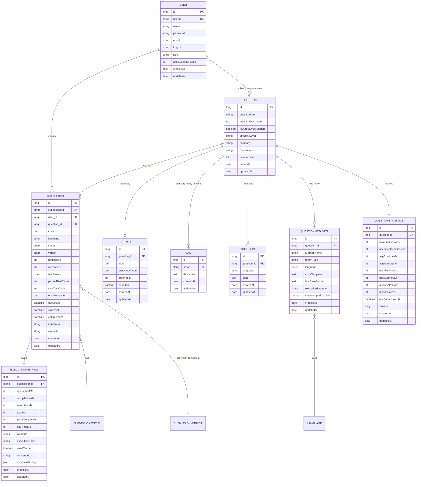
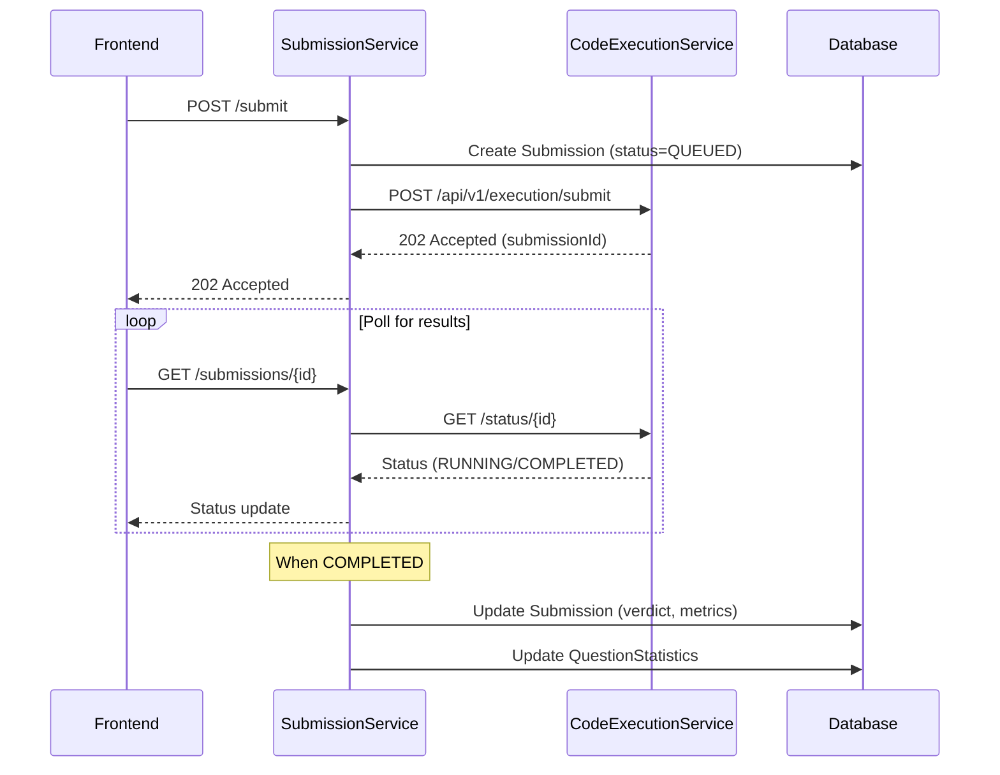

# AlgoCrack Entity Service - Complete Context

## Overview

**AlgoCrack-EntityService** is a Spring Boot library that serves as the **single source of truth** for all database models in the AlgoCrack LeetCode-like microservices platform. It provides shared JPA entities that are consumed by other microservices (like SubmissionService and CodeExecutionEngine) via Maven/Gradle dependency.

This service does not expose any REST endpoints—it is a **pure entity library** published via JitPack for use across the microservices ecosystem.

---

## Project Architecture

```mermaid
flowchart TD
    subgraph EntityService["AlgoCrack-EntityService (Library)"]
        BaseModel[BaseModel]
        User[User]
        Question[Question]
        Submission[Submission]
        TestCase[TestCase]
        Tag[Tag]
        Solution[Solution]
        QuestionMetadata[QuestionMetadata]
        QuestionStatistics[QuestionStatistics]
        ExecutionMetrics[ExecutionMetrics]
        Language[Language Enum]
        SubmissionStatus[SubmissionStatus Enum]
        SubmissionVerdict[SubmissionVerdict Enum]
    end

    subgraph ConsumerServices["Consumer Microservices"]
        SubmissionService[SubmissionService]
        CodeExecutionService[CodeExecutionService]
        QuestionService[QuestionService - Future]
        UserService[UserService - Future]
    end

    subgraph Database
        MySQL[(MySQL - leetcode)]
    end

    EntityService --> |Published via JitPack| ConsumerServices
    ConsumerServices --> |@EntityScan| EntityService
    ConsumerServices --> |CRUD Operations| MySQL
```

---

## Technology Stack

| Category | Technology | Version |
|----------|------------|---------|
| Framework | Spring Boot | 3.5.4 |
| Language | Java | 24 |
| Build Tool | Gradle | - |
| Database | MySQL | - |
| ORM | Spring Data JPA | - |
| Migration | Flyway | - |
| Validation | Spring Validation | - |
| Annotations | Lombok | - |
| Publishing | Maven Publish + JitPack | - |

---

## Package Structure

```
src/main/java/com/hrishabh/algocrackentityservice/
├── AlgoCrackEntityServiceApplication.java   # Main application entry
├── config/
│   └── JpaConfig.java                        # JPA Auditing configuration
└── models/
    ├── BaseModel.java                        # Abstract parent entity
    ├── ExecutionMetrics.java                 # Execution analytics entity
    ├── Language.java                         # Programming language enum
    ├── Question.java                         # Question/Problem entity
    ├── QuestionMetadata.java                 # Code execution metadata
    ├── QuestionStatistics.java               # Per-question analytics
    ├── Solution.java                         # Official solutions
    ├── Submission.java                       # User code submissions (async tracking)
    ├── SubmissionStatus.java                 # Status enum (QUEUED, RUNNING, etc.)
    ├── SubmissionVerdict.java                # Verdict enum (ACCEPTED, WRONG_ANSWER, etc.)
    ├── Tag.java                              # Category/Topic tags
    ├── TestCase.java                         # Test case input/output
    └── User.java                             # User account entity
```

---

## Entity Relationship Diagram



---

## Data Models (Complete Definitions)

### BaseModel (Abstract Parent)

All entities extend this abstract class for common audit fields.

**File:** `models/BaseModel.java`

| Field | Type | JPA Annotation | Description |
|-------|------|----------------|-------------|
| `id` | `long` | `@Id`, `@GeneratedValue(IDENTITY)` | Auto-incremented primary key |
| `createdAt` | `Date` | `@CreatedDate`, `@Temporal(TIMESTAMP)` | Automatically set on entity creation |
| `updatedAt` | `Date` | `@LastModifiedDate`, `@Temporal(TIMESTAMP)` | Automatically updated on entity modification |

---

### Enums

#### SubmissionStatus

**File:** `models/SubmissionStatus.java`

| Value | Description |
|-------|-------------|
| `QUEUED` | Submission is queued waiting for a worker |
| `COMPILING` | Code is being compiled |
| `RUNNING` | Code is executing against test cases |
| `COMPLETED` | Execution completed (check verdict for result) |
| `FAILED` | System error occurred (not user code error) |
| `CANCELLED` | Submission was cancelled by user or timeout |

#### SubmissionVerdict

**File:** `models/SubmissionVerdict.java`

| Value | Description |
|-------|-------------|
| `ACCEPTED` | All test cases passed |
| `WRONG_ANSWER` | Output doesn't match expected output |
| `TIME_LIMIT_EXCEEDED` | Execution took too long |
| `MEMORY_LIMIT_EXCEEDED` | Used too much memory |
| `RUNTIME_ERROR` | Exception/crash during execution |
| `COMPILATION_ERROR` | Code failed to compile |
| `INTERNAL_ERROR` | System/judge error (not user's fault) |

#### Language

**File:** `models/Language.java`

| Value | Description |
|-------|-------------|
| `JAVA` | Java programming language |
| `PYTHON` | Python programming language |
| `CPP` | C++ programming language |
| `JAVASCRIPT` | JavaScript programming language |

---

### Submission (Upgraded for Async Architecture)

Represents a code submission with full async lifecycle tracking.

**File:** `models/Submission.java`

| Field | Type | Constraints | Description |
|-------|------|-------------|-------------|
| `submissionId` | `String` | `UNIQUE`, `NOT NULL`, 36 chars | UUID for external reference |
| `user` | `User` | `@ManyToOne`, `LAZY` | User who submitted |
| `question` | `Question` | `@ManyToOne`, `LAZY` | Question being solved |
| `language` | `String` | `NOT NULL`, 20 chars | Programming language |
| `code` | `String` | `TEXT`, `NOT NULL` | Source code |
| `status` | `SubmissionStatus` | `@Enumerated(STRING)` | Current processing status |
| `verdict` | `SubmissionVerdict` | `@Enumerated(STRING)` | Final result (when completed) |
| `runtimeMs` | `Integer` | - | Execution time in ms |
| `memoryKb` | `Integer` | - | Memory usage in KB |
| `testResults` | `String` | `JSON` | JSON array of test case results |
| `passedTestCases` | `Integer` | - | Count of passed tests |
| `totalTestCases` | `Integer` | - | Total test count |
| `errorMessage` | `String` | `TEXT` | Error message if failed |
| `compilationOutput` | `String` | `TEXT` | Compilation output/errors |
| `queuedAt` | `LocalDateTime` | `NOT NULL` | When queued |
| `startedAt` | `LocalDateTime` | - | When execution started |
| `completedAt` | `LocalDateTime` | - | When completed |
| `ipAddress` | `String` | 45 chars | Client IP |
| `userAgent` | `String` | `TEXT` | Client user agent |
| `workerId` | `String` | 50 chars | Worker that processed |

**Database Indexes:**
- `idx_submission_id` - Fast lookup by UUID
- `idx_user_status` - User's submissions by status
- `idx_question_status` - Question submissions by status
- `idx_status_queued` - Queue monitoring

**Calculated Methods:**
- `getProcessingTimeMs()` - Total time from queue to completion
- `getQueueWaitTimeMs()` - Time spent waiting in queue
- `isAccepted()` - Check if verdict is ACCEPTED

---

### QuestionStatistics (New)

Aggregate analytics for each question.

**File:** `models/QuestionStatistics.java`

| Field | Type | Constraints | Description |
|-------|------|-------------|-------------|
| `questionId` | `Long` | `UNIQUE`, `NOT NULL` | Question ID |
| `totalSubmissions` | `Integer` | `NOT NULL`, default 0 | Total submissions |
| `acceptedSubmissions` | `Integer` | `NOT NULL`, default 0 | Accepted submissions |
| `avgRuntimeMs` | `Integer` | - | Average runtime of accepted |
| `avgMemoryKb` | `Integer` | - | Average memory of accepted |
| `bestRuntimeMs` | `Integer` | - | Best (min) runtime |
| `bestMemoryKb` | `Integer` | - | Best (min) memory |
| `uniqueAttempts` | `Integer` | - | Unique users who attempted |
| `uniqueSolves` | `Integer` | - | Unique users who solved |
| `avgAttemptsToSolve` | `Double` | - | Avg attempts to solve |
| `lastSubmissionAt` | `LocalDateTime` | - | Most recent submission |
| `version` | `Long` | `@Version` | Optimistic locking |

**Calculated Methods:**
- `getAcceptanceRate()` - Calculate percentage
- `incrementSubmissions(accepted, runtime, memory)` - Update statistics

---

### ExecutionMetrics

Detailed execution analytics for monitoring.

**File:** `models/ExecutionMetrics.java`

| Field | Type | Description |
|-------|------|-------------|
| `submissionId` | `String` | Reference to submission (UUID) |
| `queueWaitMs` | `Integer` | Time waiting in queue |
| `compilationMs` | `Integer` | Compilation time |
| `executionMs` | `Integer` | Execution time |
| `totalMs` | `Integer` | End-to-end time |
| `peakMemoryKb` | `Integer` | Peak memory usage |
| `cpuTimeMs` | `Integer` | CPU time used |
| `workerId` | `String` | Worker that processed |
| `executionNode` | `String` | Hostname/IP of node |
| `usedCache` | `Boolean` | Whether result was cached |
| `containerId` | `String` | Docker container ID |
| `testCaseTimings` | `String` | JSON timing breakdown |

---

### User

Represents a user/developer account on the platform.

**File:** `models/User.java`

| Field | Type | Constraints | Description |
|-------|------|-------------|-------------|
| `name` | `String` | - | User's display name |
| `password` | `String` | - | Hashed password |
| `email` | `String` | - | User's email address |
| `userId` | `String` | `UNIQUE`, `NOT NULL` | External unique identifier |
| `questionsSolved` | `Set<Question>` | `@ManyToMany` | Questions solved |
| `pastSubmissions` | `List<Submission>` | `@OneToMany` | All submissions |
| `imgUrl` | `String` | Optional | Profile image URL |
| `rank` | `String` | Column: `ranking` | User's rank |
| `achievementPoints` | `Integer` | - | Gamification points |

---

### Question

Represents a coding problem/question.

**File:** `models/Question.java`

| Field | Type | Description |
|-------|------|-------------|
| `questionTitle` | `String` | Title of the problem |
| `questionDescription` | `String` | Full problem description |
| `testCases` | `List<TestCase>` | All test cases |
| `isOutputOrderMatters` | `Boolean` | Whether order matters |
| `correctAnswer` | `List<Submission>` | Accepted submissions |
| `tags` | `List<Tag>` | Category tags |
| `difficultyLevel` | `String` | Easy/Medium/Hard |
| `company` | `String` | Company that asked |
| `constraints` | `String` | Input constraints |
| `timeoutLimit` | `Integer` | Max execution time |
| `solutions` | `List<Solution>` | Official solutions |
| `metadataList` | `List<QuestionMetadata>` | Execution metadata |

---

### TestCase

Test case for validating submissions.

**File:** `models/TestCase.java`

| Field | Type | Description |
|-------|------|-------------|
| `question` | `Question` | Parent question |
| `input` | `String` | JSON input parameters |
| `expectedOutput` | `String` | JSON expected result |
| `orderIndex` | `Integer` | Execution order |
| `isHidden` | `Boolean` | Hide from user |

---

### Tag

Category/topic tag for questions.

**File:** `models/Tag.java`

| Field | Type | Constraints | Description |
|-------|------|-------------|-------------|
| `name` | `String` | `UNIQUE`, `NOT NULL` | Tag name |
| `questions` | `List<Question>` | `@ManyToMany` | Tagged questions |
| `description` | `String` | `TEXT` | Tag description |

---

### Solution

Official/editorial solution.

**File:** `models/Solution.java`

| Field | Type | Description |
|-------|------|-------------|
| `question` | `Question` | Parent question |
| `language` | `String` | Programming language |
| `code` | `String` | Solution code |

---

### QuestionMetadata

Execution metadata per language.

**File:** `models/QuestionMetadata.java`

| Field | Type | Description |
|-------|------|-------------|
| `functionName` | `String` | Solution function name |
| `returnType` | `String` | Function return type |
| `paramTypes` | `List<String>` | Parameter types |
| `paramNames` | `List<String>` | Parameter names |
| `language` | `Language` | Programming language |
| `codeTemplate` | `String` | Starter code template |
| `testCaseFormat` | `String` | Test case JSON schema |
| `executionStrategy` | `String` | function/main/class |
| `customInputEnabled` | `Boolean` | Allow custom input |
| `question` | `Question` | Parent question |

---

## Complete Relationship Summary

### One-to-Many Relationships

| Owner Entity | Owned Entity | Field | Cascade |
|--------------|--------------|-------|---------|
| `User` | `Submission` | `pastSubmissions` | `ALL` |
| `Question` | `TestCase` | `testCases` | `ALL` |
| `Question` | `Submission` | `correctAnswer` | `ALL` |
| `Question` | `Solution` | `solutions` | `ALL`, `orphanRemoval` |
| `Question` | `QuestionMetadata` | `metadataList` | `ALL`, `orphanRemoval` |

### Many-to-One Relationships

| Entity | Related Entity | Field | Join Column |
|--------|----------------|-------|-------------|
| `Submission` | `User` | `user` | `user_id` |
| `Submission` | `Question` | `question` | `question_id` |
| `TestCase` | `Question` | `question` | `question_id` |
| `Solution` | `Question` | `question` | `question_id` |
| `QuestionMetadata` | `Question` | `question` | `question_id` |

### Many-to-Many Relationships

| Entity A | Entity B | Join Table | FK A | FK B |
|----------|----------|------------|------|------|
| `User` | `Question` | `user_questionsolved` | `user_id` | `question_id` |
| `Question` | `Tag` | `question_tag` | `question_id` | `tag_id` |

### One-to-One Relationships

| Entity A | Entity B | Description |
|----------|----------|-------------|
| `Question` | `QuestionStatistics` | via `questionId` |
| `Submission` | `ExecutionMetrics` | via `submissionId` |

---

## How Consumer Services Use This Library

### Step 1: Add Dependency

In consumer service's `build.gradle`:

```groovy
repositories {
    maven { url 'https://jitpack.io' }
}

dependencies {
    implementation 'com.github.hrishabh6:AlgoCrack-EntityService:v2.0.0'
}
```

### Step 2: Configure Entity Scanning

```java
@SpringBootApplication
@EntityScan("com.hrishabh.algocrackentityservice.models")
@EnableJpaRepositories("com.hrishabh.consumerservice.repository")
public class ConsumerServiceApplication { ... }
```

---

## Async Execution Flow

With the new architecture, submissions follow this async flow:


